## Autor
- [Jaider Steeven Mendoza Cardona](https://github.com/Dabrox02)

# Proyecto Presupuesto Casa
Este proyecto consiste en la integración de las tecnologias aprendidas con el fin de crear una aplicacion funcional que tenga la capacidad de consumir una Fake Api.

## Tecnologias
Para la concepción del proyecto se hizo uso de las siguientes tecnologias, las cuales se integraron para crear el proyecto:

- HTML (HyperText Markup Language)
- CSS (Cascading Style Sheets)
- Bootstrap
- JavaScript
- [MockApi](https://mockapi.io/)

## Requisitos Minimos
Hay algunos requisitos y consideraciones que el cliente debe tener en cuenta para garantizar una implementación exitosa de la aplicación web:

- Acceso a Internet
- Dispositivo Compatible
- Navegador Compatible:
  - [Mozilla Firefox](https://www.mozilla.org/es-ES/firefox/new/)
  - [Google Chrome](https://www.google.com/chrome/)


## Guía de Instalación y Configuración de json-server
### Requisitos previos:
- **NVM** es una herramienta que te permite administrar múltiples versiones de Node.js en tu máquina.

**Instalación de NVM en Linux y macOS**
1. Abre tu terminal.
2. Utiliza `curl` o `wget` para descargar el script de instalación de NVM desde el repositorio oficial de GitHub. Puedes usar uno de los siguientes comandos:

   Utilizando `curl`:

   ```bash
   curl -o- https://raw.githubusercontent.com/nvm-sh/nvm/v0.39.5/install.sh | bash
   ```

   Utilizando `wget`:

   ```bash
   wget -qO- https://raw.githubusercontent.com/nvm-sh/nvm/v0.39.5/install.sh | bash
   ```

   Asegúrate de verificar la URL en el comando con la versión actual de NVM en [GitHub](https://github.com/nvm-sh/nvm).

3. Después de ejecutar el comando, seguirás las instrucciones en la terminal para completar la instalación.

4. Cierra y vuelve a abrir tu terminal o ejecuta `source ~/.bashrc` o `source ~/.zshrc` (dependiendo de tu shell) para cargar NVM en tu sesión actual.

***
**Uso de NVM**

Una vez instalado NVM, puedes usar los siguientes comandos para gestionar las versiones de Node.js en tu sistema:

- Para instalar una versión específica de Node.js, por ejemplo, Node.js ultima version estable:
  ```bash
  nvm install --lts
  ```
- Para seleccionar una versión específica de Node.js para usar:

  ```bash
  nvm use <version>
  ```
Recuerda consultar la [documentación oficial de NVM](https://github.com/nvm-sh/nvm) para obtener más detalles y opciones de configuración avanzadas.
***

## Instalación json-server

Abre tu terminal y ejecuta el siguiente comando para instalar `json-server`:

```bash
npm install -E -D json-server
```

Esto instalará `json-server` con la ultima version estable de acuerdo a nuestra versión de Node.js

## Ejecución de json-server

**Inicia json-server:**
En tu terminal, ejecuta `json-server` y especifica el archivo JSON que deseas utilizar como fuente de datos:

```bash
json-server --watch db.json --port 5855
```

## Inicializacion del proyecto
Si clonas este repositorio, debes utilizar el siguiente comando para instalar las dependencias necesarias:
```bash
npm init
```

Una vez instaladas, para ejecutar el json-server con la configuracion antes mencionada utiliza el siguiente comando:
```bash
npm run dev
```

Esto iniciará `json-server` y lo configurará para escuchar en el puerto `5855`. Ahora, la API REST simulada estará disponible en `http://localhost:5855`.


### Interaccion con la API json-server
### Esquema de los datos
| Campo | Tipo      |
| ----- | --------- |
| id    | Object ID |
| caja  | STRING    |
| valor | NUMBER    |

***
**API URI:** `http://localhost:5855/`

**Acceso a la API:**
Puedes acceder a la API a través del **endpoint** `presupuesto`:
```bash
http://localhost:5855/presupuesto
```

## Uso de la Aplicación
Esta aplicacion web permite llevar un control de gastos, puedes agregar los ingresos y egresos que has tenido y te calculara el total de los mismos, tambien puedes editar y eliminarlos por si llegas a equivocarte.

### Como Ingresar datos
Para ingresar datos, selecciona el campo e ingresa el monto que deseas añadir, luego selecciona si es un ingreso o egreso y posteriormente dale en calcular.

<div align="center">
  <h3>Paso 1</h3>
  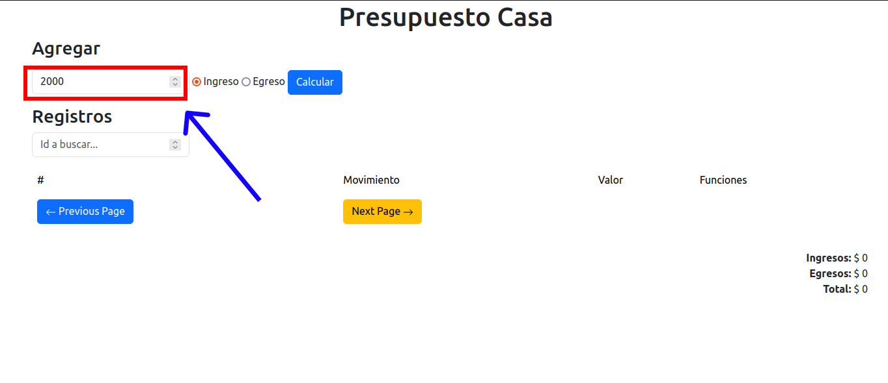
  <h3>Paso 2</h3>
  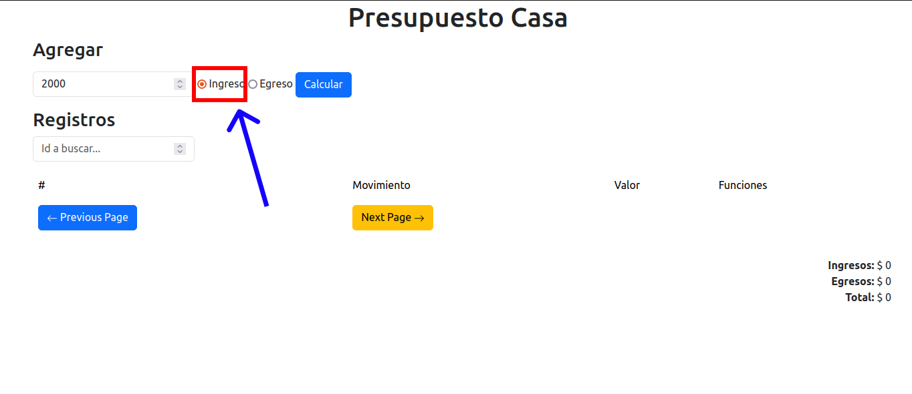
  <h3>Paso 3</h3>
  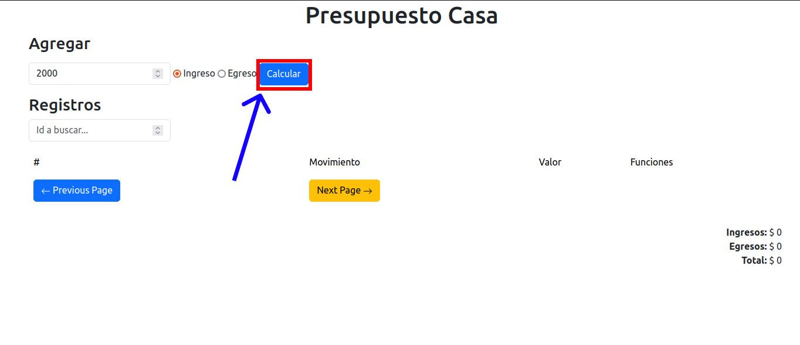
  <h3>Resultado</h3>
  
</div>

### Eliminar Registro
Para eliminar un registro, selecciona el boton color **rojo** en la fila del registro que deseas eliminar y dale **clic**.

<div align="center">
  <h3>Paso 1</h3>
  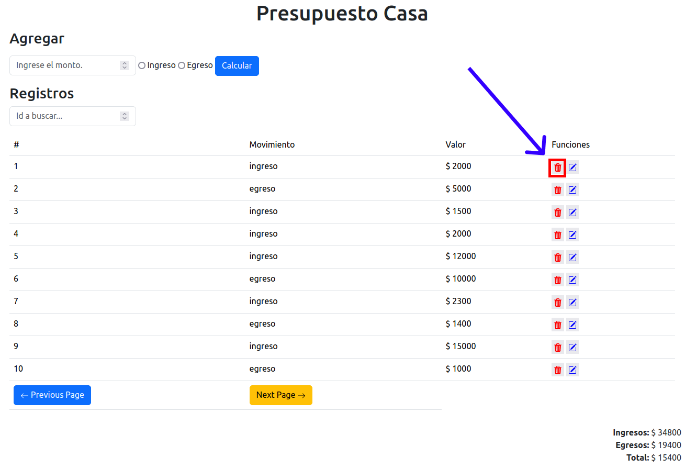
  <h3>Resultado</h3>
  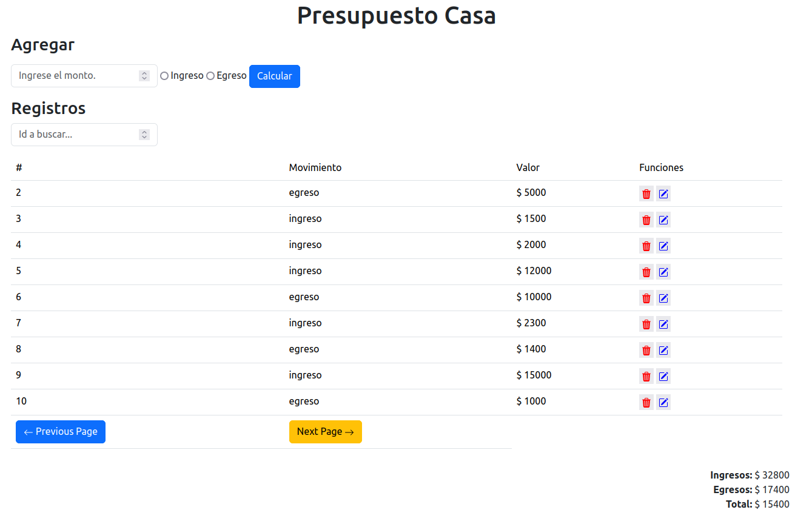
<div>

### Editar Registro
Para editar un registro, selecciona el boton color **azul** en la fila del registro que deseas editar y dale **clic**, posteriormente, introduce los nuevos datos y da clic en calcular.

<div align="center">
  <h3>Paso 1</h3>
  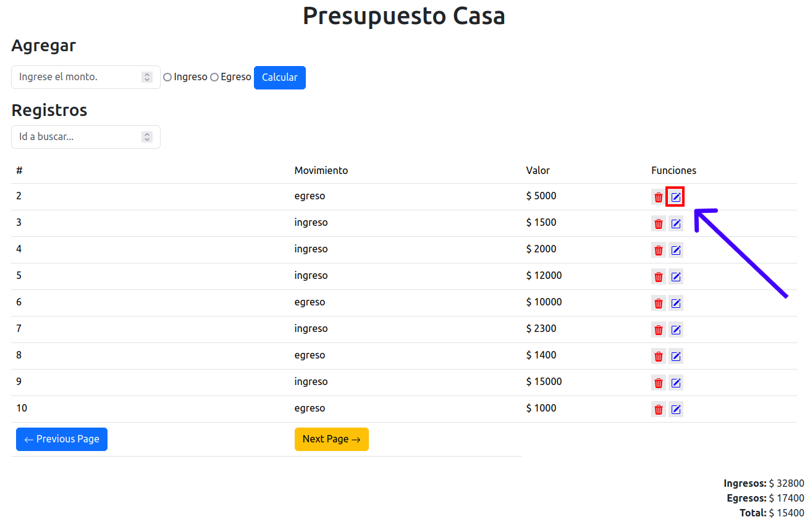
  <h3>Paso 2</h3>
  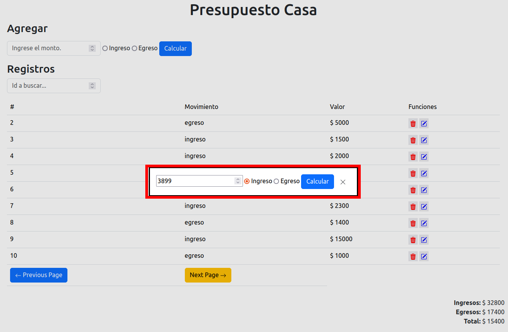
  <h3>Resultado</h3>
  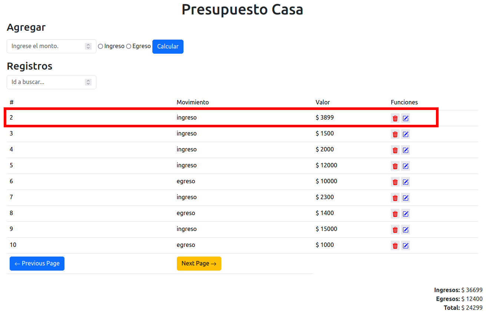
<div>

### FIltrar registro
Para filtrar un registro, selecciona el campo **Id a buscar** e introduce el id del registro que deseas ver, dale a la tecla **ENTER** para buscarlo. 

<div align="center">
  <h3>Paso 1</h3>
  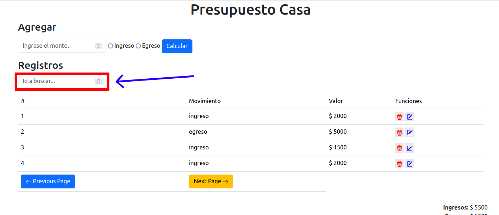
  <h3>Resultado</h3>
  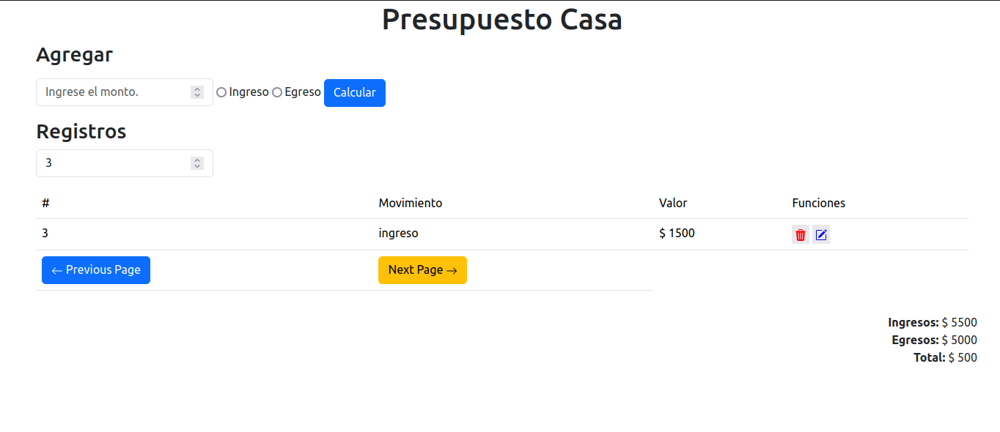
<div>

### Moverse  entre paginas
Si existen muchos registros, pueden moverte utilizando los botones en la parte inferior de la tabla de registros.

<div align="center">
  <h3>Paso 1</h3>
  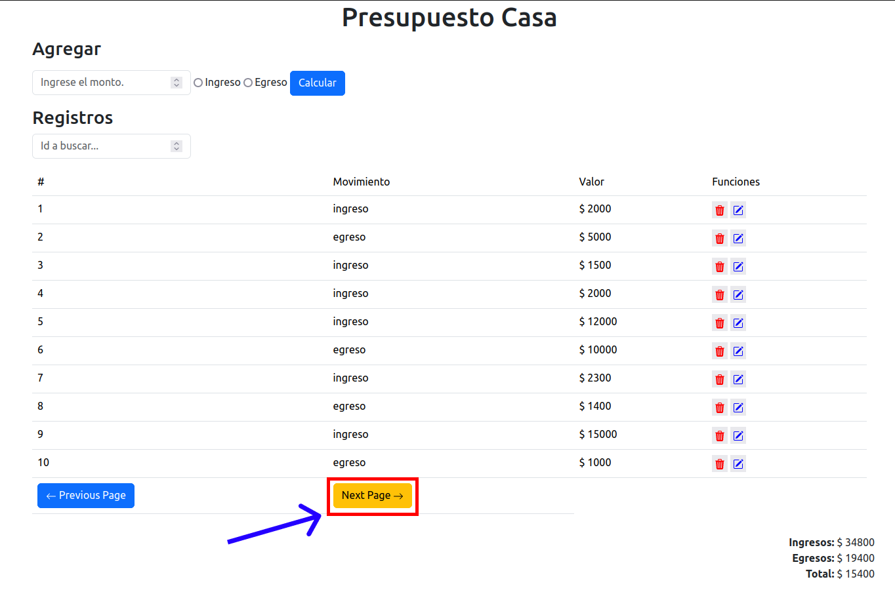
  <h3>Resultado</h3>
  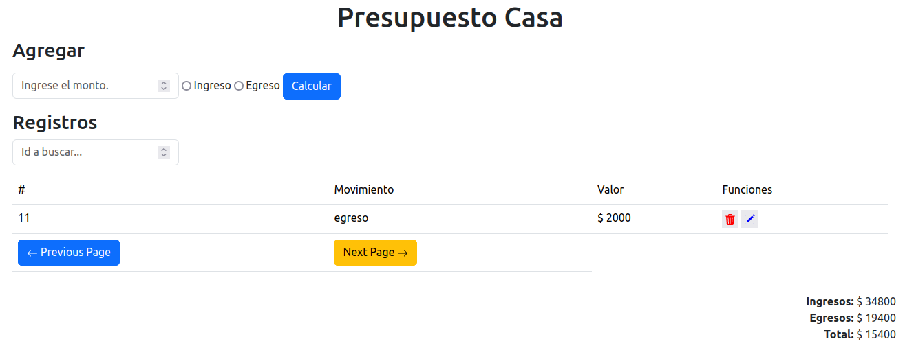
<div>

## Resultado
<a href="https://dabrox02.github.io/proyecto-presupuesto-casa/" target="_blank">
    Click Aqui para Ver
    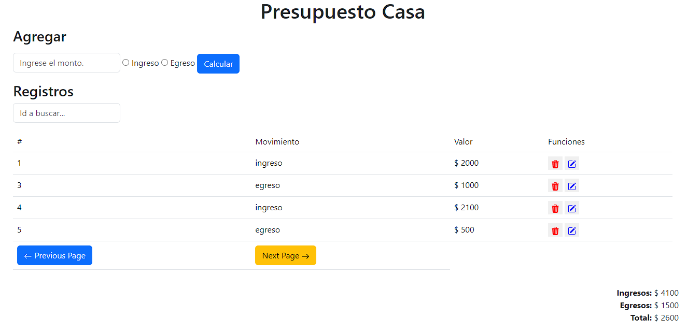
</a>
